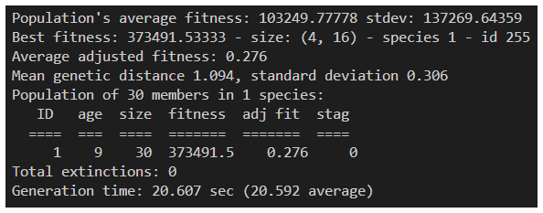
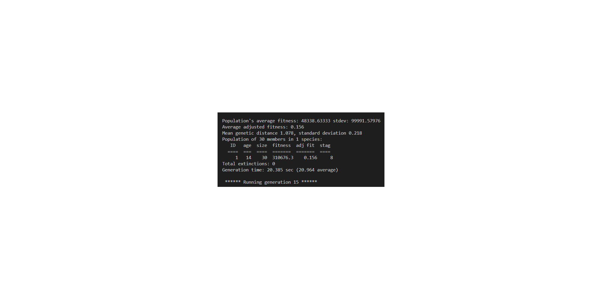
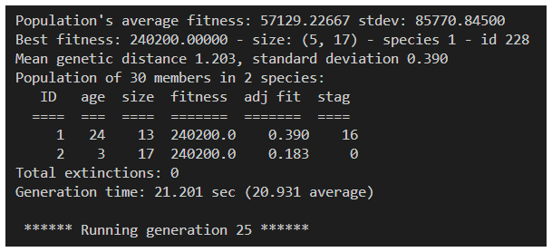
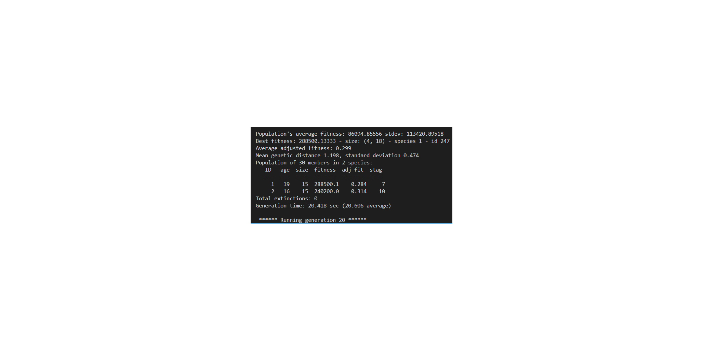
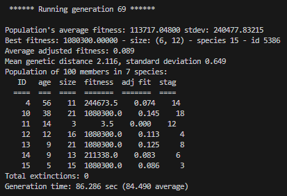

# AI Car Simulation with NEAT — Machine Learning Final Project

A **fork of [NeuralNine/ai-car-simulation](https://github.com/NeuralNine/ai-car-simulation)**, used as the subject of our Machine Learning final project at Tunghai University (Fall 2024). The upstream repository supplies the pygame simulation and the `neat-python` integration; **our work was to study that code, run it across six tracks, and tune it until it solved the track the default configuration could not.**

**Presentation:** [*Vehicle Route Optimization* — final presentation slides](https://drive.google.com/drive/folders/1FK7mEH16lqAlgYZqKUG-sjISO-0odVCx?usp=sharing) (26 slides, Google Drive)

**Team:** 黃少鯤 · 黃睿廷 · 黃子修 · 鄭聿宏 · 蔡承赫

> **Scope, stated plainly.** The simulation, the radar sensing, the collision logic and the NEAT wiring are all upstream code, not ours. What follows is limited to what we changed and what we measured. Every change listed below is visible in the diff against the fork point:
> ```
> git diff ccb6509 HEAD
> ```

---

## The result: a configuration that solves `map5`

We ran the upstream default configuration on `map1`–`map5`. It learned the first four tracks quickly and **failed completely on `map5`**, the tightest, most winding track in the set. After changing the NEAT parameters and the fitness function, the same algorithm solved it.

### The problem

Terminal output from those five runs is in [`pic/`](pic), one screenshot per track, all under the upstream defaults. Read side by side, `map5` is not merely slower — it is a different regime:

| Track | Generation | Best fitness | Species |
|---|---|---|---|
| `map1` | 9 | 373,492 | 1 |
| `map2` | 14 | 310,676 | 1 |
| `map3` | 24 | 240,200 | 2 |
| `map4` | 19 | 288,500 | 2 |
| **`map5`** | **246** | **8,550** | 2 |

Four tracks reach 240k–373k within 24 generations. `map5` is still at 8,550 after 246 — roughly **30× lower fitness after 10× more generations.**


The `stag` column is the diagnosis. The leading species had gone 222 generations without improving, so the population had converged and further generations would not have helped.

<details>
<summary>Terminal output for the four tracks that did work (map1–map4)</summary>

| | |
|---|---|
|  |  |
|  |  |

</details>

*(These are snapshots taken while each run was in progress, not converged final scores. `pic/mapN.png` is the terminal output for the run on track `mapN.png`, not a picture of the track itself.)*

### The fix

| `map5` | Upstream defaults | Our configuration |
|---|---|---|
| Generation shown | 246 | 69 |
| Best fitness | **8,550** | **1,080,300** (≈ 126×) |
| Population mean fitness | 2,558 | **113,717** (≈ 44×) |
| Population / species | 30 / 2 | 100 / 7 |
| Stagnation of the top species | 222 generations | — |
| Species tied at the best score | 1 of 2 | 4 of 7 |
| Wall-clock per generation | 4.3 s | 86.3 s |



Two things in that screenshot matter as much as the headline number.

The gain is **not one lucky genome**: four of the seven species reach the same top score of 1,080,300, so several independent lineages found a solution rather than one outlier carrying the run.

And generation time rises from 4.3 s to 86.3 s. A generation ends once every car has crashed, so a twentyfold increase in wall-clock time is itself a measurement: the cars stopped dying early and started surviving most of the episode.

*(`pic/map5_solved.png` is taken from slide 20 of the presentation; `pic/map5_fail.png` is the corresponding run under the defaults, slide 19.)*

---

## What we changed

### `config.txt`

| Parameter | Upstream | Ours | Reason |
|---|---|---|---|
| `pop_size` | 30 | **100** | 30 genomes was too small to keep several species alive; the population collapsed onto one lineage and stagnated |
| `num_outputs` | 4 | **2** | Dropped throttle control, leaving only *turn left* / *turn right*. A constant speed keeps the turning radius small enough for tight corners |
| `compatibility_threshold` | 2.0 | **2.5** | Groups genomes more loosely, so new topologies are not immediately isolated into their own species |
| `max_stagnation` | 20 | **15** | Retires dead-end species sooner |
| `species_elitism` | 2 | **3** | Protects one more species from extinction |
| `survival_threshold` | 0.2 | **0.17** | Slightly stronger selection pressure per generation |

### `newcar.py`

| Change | Upstream | Ours |
|---|---|---|
| Crash penalty in `get_reward` | none — fitness was distance only | returns `-100` when the car is dead, so crashing early is explicitly punished rather than merely unrewarded |
| Initial speed | 20 | **5** |
| Episode length | `60 * 40` frames | `60 * 160` frames — the longer tracks need far more time than the oval |
| Generation cap | 1,000 | 10,000 |
| Display | `pygame.FULLSCREEN` | windowed, so the terminal output stays visible while the run is watched |
| Track selection | `map.png` hard-coded in the draw loop | a single `MAP` constant at the top of the file |
| HUD position | centred for 1600×880 | repositioned for 1920×1080 |

Also added: `map6.png`, `requirements.txt`, and `.gitignore`; `map.png` renamed to `map1.png`.

---

## How it works

Each car carries **five radar rays** at −90°, −45°, 0°, +45° and +90°. Each ray walks outward pixel by pixel until it meets the white boundary colour, up to 300 px; the five distances (divided by 30) are the network's inputs.

The network's **two outputs** are compared and the larger one wins: turn left 10°, or turn right 10°. Speed is fixed at 5 px per step.

**Fitness** accumulates `distance / 30` on every step the car stays alive, so a car that survives longer scores superlinearly; a dead car receives `-100`. A generation ends when every car has crashed or the frame cap is reached.

NEAT starts from a minimal fully-connected network and grows nodes and connections through mutation, grouping similar genomes into species so that new topologies get time to mature before competing with established ones.

---

## Running it

```bash
pip install -r requirements.txt
python newcar.py
```

Switch tracks by editing the `MAP` constant at the top of `newcar.py` (`map1.png` … `map6.png`). The window is 1920×1080; `map1` is the easiest track and `map5` the hardest.

---

## Known issues

These are unresolved problems in the current code, listed so that anyone reading it knows what to expect:

1. **Dead branches in the action handler.** `run_simulation` still contains the upstream `choice == 2` / `else` branches for slowing down and speeding up, but `num_outputs = 2` makes them unreachable. They should be deleted, or the configuration changed back to 4 outputs.
2. **The vertical position clamp uses the wrong constant.** `newcar.py` clamps `position[1]` with `WIDTH - 120` (1800) instead of `HEIGHT - 120` (960), so it never clamps within the 1080-pixel map. A car that reaches the bottom edge can produce a corner coordinate past the end of the surface, and `Surface.get_at` raises `IndexError`.
3. **`check_radar` has no bounds check.** The ray walks up to 300 px without testing whether it has left the map, which can raise `IndexError` for the same reason.
4. **Results are screenshots, not logs.** Every number above was read off a terminal capture in `pic/` or off slides 19–20. `neat-python`'s `StatisticsReporter` is already attached in `newcar.py`, but its output is never saved and no seed is set, so there are no fitness curves and the runs cannot be reproduced as recorded. Recovering curves would require re-running, not re-reading — the original runs were never written to disk.
5. **The presentation and the committed config disagree.** Slide 21 lists `max_stagnation = 30` and `survival_threshold = 0.15`; `config.txt` has `15` and `0.17`. Tuning continued after the slides were made.
6. **Single run per configuration.** NEAT is stochastic and no run was repeated, so the `map5` comparison is one run against one run.

---

## Follow-up work

This project was extended the following semester into a Deep Learning capstone that rebuilds the same environment as a Gymnasium environment trained with PPO, and runs a controlled ablation over reward and observation design: **[rl-car-reward-vs-observation](https://github.com/h-s-i-u/rl-car-reward-vs-observation)**.

---

## Credits

The simulation, radar sensing, collision detection and NEAT integration are the work of **[NeuralNine (Florian Dedov)](https://github.com/NeuralNine/ai-car-simulation)**, itself based on a tutorial by **Cheesy AI** ([video](https://www.youtube.com/watch?v=Cy155O5R1Oo)). Full credit to them for the original project. This fork is for academic coursework only, with no commercial intent.

## References

1. K. O. Stanley and R. Miikkulainen, "Evolving Neural Networks through Augmenting Topologies," *Evolutionary Computation*, 10(2), pp. 99–127, 2002. ([PDF](http://nn.cs.utexas.edu/downloads/papers/stanley.ec02.pdf))
2. `neat-python` documentation — https://neat-python.readthedocs.io/
3. NeuralNine, "ai-car-simulation" — https://github.com/NeuralNine/ai-car-simulation
